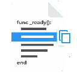

# CopyFileLine

`CopyFileLine` is a lightweight Godot 4.5.1+ editor plugin designed to make
sharing code, reporting bugs, and documenting workflows faster and easier.

No more manual entry of file paths and line numbers. With one keystroke,
quickly copy references like `res://path/to/file.gd:42`. It is ideal for sharing
snippets, reporting issues, or linking specific lines in conversations.

## Features

- **Keyboard Shortcut** – Press `Ctrl+Shift+C` to copy instantly (customizable)
- **Menu Access** – Also available via **Project > Tools > Copy file:line**
- **Configurable** – Change the shortcut key and modifiers in plugin settings
- **Zero Friction** – Works seamlessly with Godot's script editor
- **Standard Format** – Copies in `res://path/file.gd:line` format

## Installation

1. Copy the `copy_file_line` folder to `your_project/addons/`
2. Go to **Project Settings > Plugins**
3. Find "CopyFileLine" and toggle it **Enabled**
4. Done! Start using it immediately

## Usage

### Keyboard Shortcut (Fastest)

1. Open any script
2. Position cursor at the target line
3. Press **Ctrl+Shift+C**
4. Path and line number are copied to clipboard

### Via Menu

1. Open a script
2. Click **Project > Tools > Copy file:line**
3. Reference is ready to paste

### Custom Shortcut

Edit the shortcut in **Project Settings > Plugins > CopyFileLine**:

- `shortcut_key` – Change the key (default: `C`)
- `use_ctrl` – Toggle Ctrl modifier
- `use_shift` – Toggle Shift modifier
- `use_alt` – Toggle Alt modifier

## Requirements

- Godot 4.5.1+
- Editor-only plugin (`@tool` script)

## Use Cases

- **Bug Reports** – Share exact line references: `res://scenes/player.gd:156`
- **Code Reviews** – Link to specific lines in discussions
- **Documentation** – Reference code snippets with line numbers
- **Team Collaboration** – Quickly communicate code locations

## License

MIT License ©2026 ッFlorin
